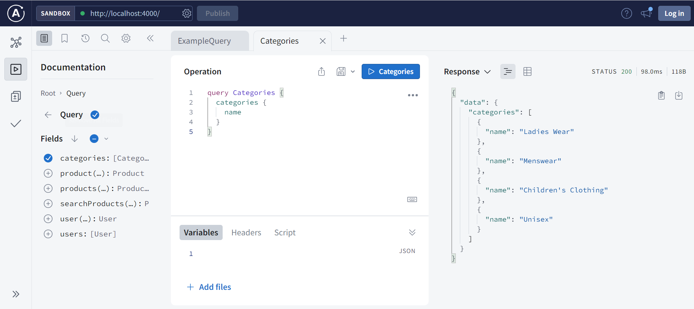
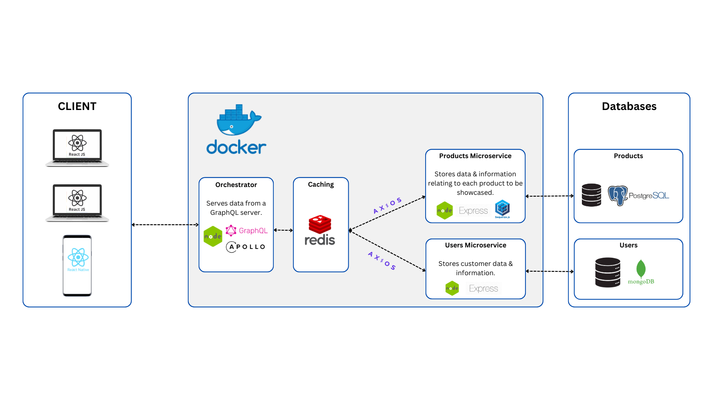

# Uniqlo Brand Showcase Clone

Example server application for a brand showcase web and mobile application (clone of the Uniqlo website and mobile app). 

Implements a microservices architecture using Docker and a Node.js orchestrator. Data is served from a GraphQL server.

## Front-end Applications
 - [Admin Content Management System](https://github.com/ValYauw/brand-showcase-uniqlo-clone-client-admin)
 - [Customer-facing web app](https://github.com/ValYauw/brand-showcase-uniqlo-clone-client-user)
 - [Customer-facing mobile app](https://github.com/ValYauw/brand-showcase-uniqlo-clone-client-mobile)

## Features 

 - CRUD (Create, Read, Update, Destroy) Entities
 - User authentication & authorization (OAuth)
 - Feature to add/edit/delete nested resources (product images) when editing main resources (product entities), using SQL transactions
 - Microservices Architecture

## Architecture

### Products microservice

REST API implemented using the following tech stack:
 - Express.js
 - PostgreSQL database
 - ORM Sequelize

### Users microservice

REST API implemented using the following tech stack:
 - Express.js
 - MongoDB database

### Orchestrator

Node.js application implemented using the following tech stack:
 - Apollo Server (GraphQL)
 - Caching with Redis

## How to run (development environment)

Run `npm install` to install all packages and dependencies.

When running the application in a development environment (local machine), be sure to add the `.env` files for each service (in each of the directories `/services/app`, `/services/users`, `/orchestrator`).

To run each microservice, go to each microservice directory and run `npm run dev`.

## How to run (production environment)

Dockerfiles have been provided to ship the application to a production environment. To get started with Dockerization, go to the directory where the file `docker-compose.yml` is located, add the `.env` file for the whole server application, and then run the command `docker compose up -d`