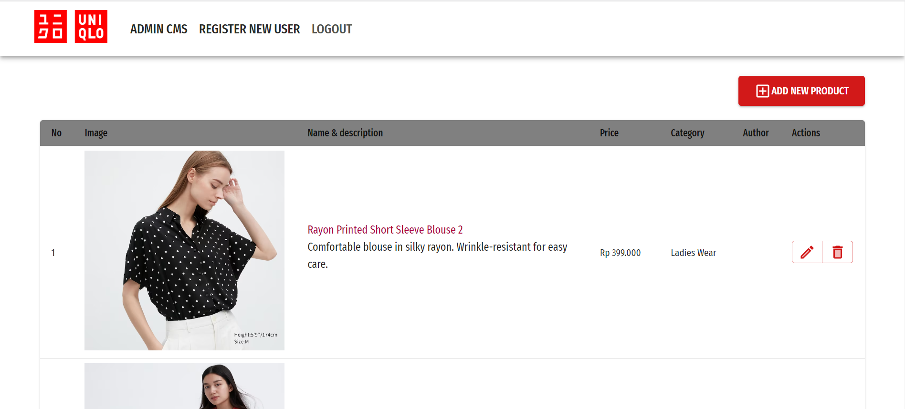
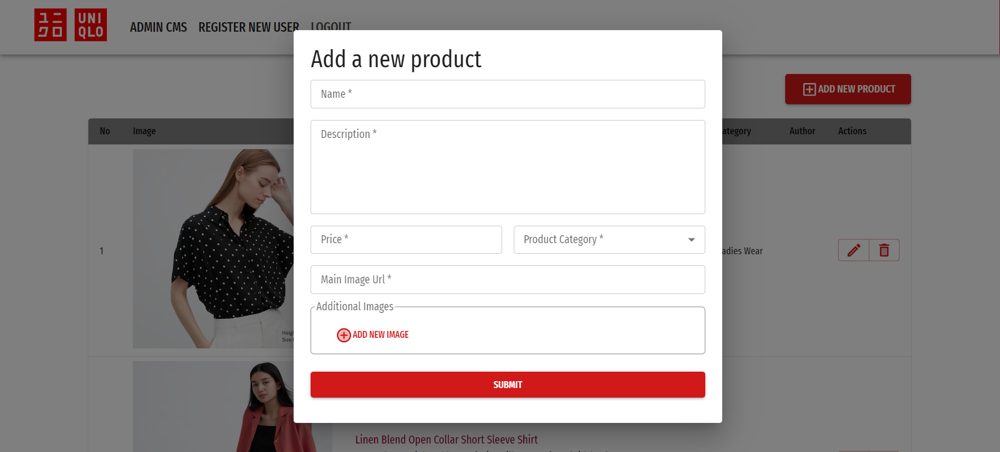
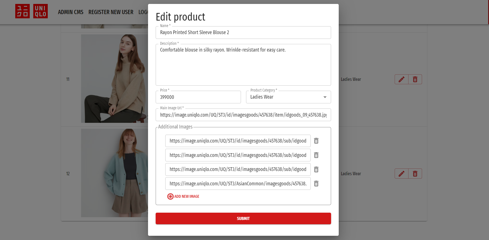

# Uniqlo Brand Showcase Clone

Example Content Management System (CMS) web application for a brand showcase web and mobile application (clone of the Uniqlo website and mobile app).

## Features

 - OAuth
 - CRUD (Create, Read, Update, Destroy)

## Tech Stack 

 - Vite (development platform)
 - React
 - Redux, Redux Thunks
 - MUI UI Library
 - Axios (to fetch data from GraphQL server)

## Configuration

Change the URL of the back-end API entrypoint in `config/api.js`.

## Demo

### Login Screen

### Admin CMS

### Create, Update, and Destroy

