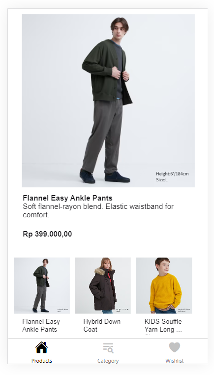

# Uniqlo Brand Showcase Clone

Example mobile application (React Native) for a brand showcase web and mobile application (clone of the Uniqlo website and mobile app).

## Tech Stack 

 - Expo Go
 - React Native Framework
 - React Native Navigation
 - React Native Paper

## Configuration

Change the URL of the back-end API entrypoint in `config/api.js`.

## Demo

